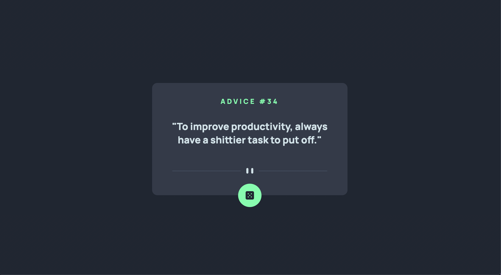

# Frontend Mentor - Advice generator app solution

This is a solution to the [Advice generator app challenge on Frontend Mentor](https://www.frontendmentor.io/challenges/advice-generator-app-QdUG-13db). Frontend Mentor challenges help you improve your coding skills by building realistic projects.

## Table of contents

- [Overview](#overview)
  - [The challenge](#the-challenge)
  - [Screenshot](#screenshot)
  - [Links](#links)
- [My process](#my-process)
  - [Built with](#built-with)
  - [What I learned](#what-i-learned)
  - [Continued development](#continued-development)
  - [Useful resources](#useful-resources)
- [Author](#author)

## Overview

This is an advice generator app that uses the Advice Slip API to generate random quotes of advice.

This project is a simple demostration of 3rd-party APIs consuming.

### The challenge

Users should be able to:

- View the optimal layout for the app depending on their device's screen size
- See hover states for all interactive elements on the page
- Generate a new piece of advice by clicking the dice icon

### Screenshot

### Links

- Solution URL: [Add solution URL here](https://your-solution-url.com)
- Live Site URL: [Add live site URL here](https://your-live-site-url.com)

## My process

My first step is always thinking about a proper structure that will suit the requirements of the project. I decide which will be the bigger parts of the project, and then I divide them into smaller components.

Then I write all the code logic, trying to make it as simple as possible. Once everything works, I start working on the style.

### Built with

- Flexbox
- [React](https://reactjs.org/) - JS library
- [Create React App](https://create-react-app.dev/) - Modern build setup with no configuration

### What I learned

I have been struggling with my projects' structure design, so working on this simple project has helped me apply some of the tips I have learned about this in a clean and faster way.

### Continued development

I want to start focusing on more complex projects so I can further challenge myself. Then I would also like to learn more about performance degradation.

### Useful resources

- [React Projects by Roy Derks](https://www.amazon.com/gp/product/B091J72TWS/ref=dbs_a_def_rwt_hsch_vapi_tkin_p1_i1) - This book helped me a lot with the structure design of my project.

## Author

- Linkedin - [Nia Robles](linkedin.com/in/nia-robles-205061249)
- GitHub - [niaveser](https://github.com/niaveser)
- Frontend Mentor - [@niaveser](https://www.frontendmentor.io/profile/niaveser)
